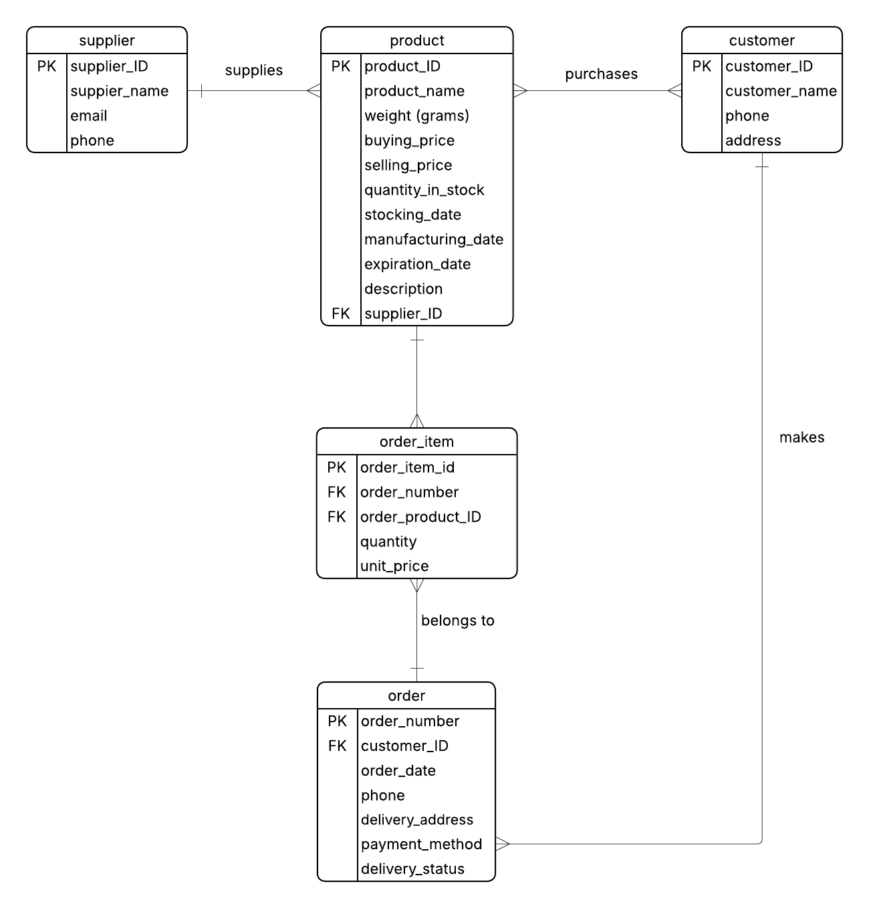

# Design Document

By Gia Ky Tran

Video overview: <(https://youtu.be/-HfSkqYXwP4)>

## Scope

This project is a database system designed for a small business that sells matcha products. The system helps the seller manage product inventory levels, supplier information, customer data, and customer orders efficiently.
It allows tracking of stock quantity, expiration dates, and supplier relationships, as well as monitoring customer orders, payment methods, and delivery status.

The scope of this project includes:
* Customers who purchase matcha products. Information stored: name, phone number, address.
* Suppliers who provide matcha products for the Matcha Seller. Information stored: supplier name, email, phone.
* Products, the matcha items sold (e.g., ceremonial matcha, culinary matcha). Includes details like weight, prices, stock levels, manufacturing and expiration dates.
* Orders from customer purchase recording that link customers with their ordered items.
* Order items, connecting the link between the products ordered by customer and their order, with specific products included in each order, with quantity and price details.

Out of scope:
* Detailed employee management or HR system.
* Accounting or tax calculation.
* Online payment gateway integration.
* Real-time delivery tracking system or reverse order tracking.

## Functional Requirements

This database allows users to perform the following functions:
* CRUD operations for seller and customers, eg. add, update, delete product details, update customer details, view products that will expire within a specific timeframe, mark products as discontinued when they are no longer sold.
* Tracking inventory level (in stock, low in stock, out of stock and minimum quantity), update product infomation, view stocks that will expire within a specific timeframe, update product status (active or discontinued)
* Record and view customer orders and identify their spending within a specific timeframe, update the order status (eg. Shipped, Delivered, Pending, etc.), cancel orders created by mistake
* Add and manage supplier details (name, email, phone), view which products are supplied by a specific supplier.

## Representation

### Entities

The database includes the following entities:

#### Suplliers
The `suppliers` table includes:
- `supplier_ID`, *INTEGER, PRIMARY KEY*: uniquely identifies each supplier. `INTEGER` is used for IDs since it’s efficient for indexing and auto-incrementing in SQLite. `PRIMARY KEY` ensures each supplier is unique.
- `supplier_name`, *TEXT, NOT NULL*: supplier’s name, required to distinguish suppliers. `TEXT` is suitable for name fields. `NOT NULL` guarantees every supplier record has essential information.
- `email`, *TEXT*: optional field for contact via email. `TEXT` is suitable for contact information that may include letters, symbols, or variable formats.
- `phone`, *TEXT*: supplier’s phone number for direct communication. `TEXT` is suitable for phone number because it preserves formatting, supports international codes, and prevents data corruption caused by numeric conversion.

#### Products
The `products` table includes:
- `product_ID`, *INTEGER, PRIMARY KEY*: unique product identifier. `PRIMARY KEY` uniquely identifies each product.
- `product_name`, *TEXT, NOT NULL*: name of the product.
- `weight_grams`, *NUMERIC, NOT NULL*: product weight for packaging and pricing. `NUMERIC` for `weight_grams` supports both integers and decimals.
- `buying_price_VND` `selling_price_VND`, *INTEGER*: prices in Vietnamese Dong. `INTEGER` for prices since currency values are stored as whole numbers in VND. No `NOT NULL` constraint in case pricing is added later.
- `min_quantity`, *INTEGER, NOT NULL, DEFAULT 10*: minimum stock before restocking. `INTEGER` for whole-number quantities. `DEFAULT 10` automatically sets a minimum stock level.
- `quantity_in_stock`, *INTEGER, NOT NULL*: number of units available. `INTEGER` represents stock count precisely. `NOT NULL` ensures availability data is always valid.
- `stocking_date`, `manufacturing_date`, `expiration_date` — *TEXT, NOT NULL, DEFAULT CURRENT_DATE*: important dates of products. `TEXT` is used for date strings in `YYYY-MM-DD` format. `NOT NULL` ensures every product has valid date records. `DEFAULT CURRENT_DATE` auto-fills missing dates with the current date.
- `description`, *TEXT*: additional product details. No constraint to keep it optional.
- `status`, *TEXT, NOT NULL, CHECK (status IN ('active','discontinued'))*: indicates if the product is currently sold or discontinued. `TEXT` stores readable states. `CHECK` constraint ensures only valid statuses can be entered.
- `supplier_ID`, *INTEGER, NOT NULL, FOREIGN KEY*: links to the supplier providing the product. `INTEGER` matches the supplier’s ID type.`FOREIGN KEY` contraint applied, referencing the `supplier_ID` in `suppliers` table,
ensuring the product belongs to a valid supplier.

##### Customers
The `customers` table includes:
- `customer_ID`, *INTEGER, PRIMARY KEY*: unique customer identifier. `INTEGER` ensures unique, efficient indexing. `PRIMARY KEY` enforces uniqueness.
- `customer_name`, *TEXT, NOT NULL*: customer’s name.`TEXT` allows any name format. `NOT NULL` ensures every record has a name.
- `phone`, *TEXT*: contact number. `TEXT` handles various phone number formats.
- `address`, *TEXT*: delivery address. `TEXT` supports complex address formats.

#### Orders
The `orders` table includes:
- `order_number`, *INTEGER, PRIMARY KEY*: unique order ID.
- `customer_ID`, *INTEGER, FOREIGN KEY*: connects to the customer who placed the order. `INTEGER` matches the customer ID type. `FOREIGN KEY` maintains data consistency between orders and customers.
- `order_date`, *TEXT, DEFAULT CURRENT_TIMESTAMP*: time when the order is created. `TEXT` suits SQLite’s date strings. `DEFAULT CURRENT_TIMESTAMP` automatically captures the order creation time.
- `phone`, *TEXT NOT NULL*: contact for the order. `TEXT` handles various phone number formats. `NOT NULL` ensures a valid contact number is always available.
- `delivery_address`, *TEXT NOT NULL*: address for delivery. `TEXT` supports complex address formats. `NOT NULL` ensures delivery details are mandatory.
- `payment_method`, *TEXT CHECK (payment_method IN ('COD','Bank Transfer','MoMo','ZaloPay','VNPay'))* : limited to accepted payment options. `TEXT` for human-readable payment names. `CHECK` guarantees only accepted methods are used.
- `status`, *TEXT CHECK (status IN ('Pending','Shipped','Delivered','Cancelled','Completed')) DEFAULT 'Pending'* : tracks order progress. `TEXT` clearly describes the order stage. `CHECK` ensures validity and `DEFAULT 'Pending'` automatically set order status to 'Pending' when first created.

#### Order_Items
The `order_items` table includes:
- `order_item_id`, *INTEGER, PRIMARY KEY*: unique item entry ID. `INTEGER` provides unique item identification. `PRIMARY KEY` ensures no duplicate line items.
- `order_number`, *INTEGER, FOREIGN KEY REFERENCES Orders(order_number)*: links to the `orders` table. `INTEGER` aligns with order IDs. `FOREIGN KEY` ensures each item belongs to an existing order.
- `product_ID`, *INTEGER, FOREIGN KEY REFERENCES Products(product_ID)*: links to the `products` table. `INTEGER` for ID matching. `FOREIGN KEY` ensures the item refers to a valid product.
- `quantity`, *INTEGER, NOT NULL*: present number of units of products that was ordered. `INTEGER` for counting units. `NOT NULL` ensures order details are complete.
- `unit_price_VND` —, *INTEGER, NOT NULL*: price of each item at time of purchase. `INTEGER` represents the unit cost in VND. `NOT NULL` ensures ensures order details are complete.

### Relationships

The below entity relationship diagram describes the relationships among the entities in the database.

**Relationships Between Entities**
**Supplier → Product** : One-to-Many Relationship
Each supplier can supply multiple products, but every product comes from exactly one supplier. For example, “Kyoto Tea House” may supply several matcha types such as “Uji Ceremonial” and “Uji Premium.”

**Customer → Order**: One-to-Many Relationship
A customer can place many orders over time, but each order belongs to a single customer. For example, customer named “Suri” might have multiple orders placed on different dates.

**Order → Order_Item**: One-to-Many Relationship
Each order can contain multiple order items (different matcha products or quantities), but each order item belongs to one specific order. For example, order #1002 might include “Uji Ceremonial 30g” and “Matcha Latte 100g.”

**Product → Order_Item** : One-to-Many Relationship
A product can appear in multiple order items (e.g., multiple customers ordering the same matcha), but each order item refers to only one product.

**Order_Item** : acts as a linking (or junction) table between `Order` and `Product`

## Optimizations

Several indexes were created to speed up data retrieval for columns that are frequently used. These indexes include:
- `search_order_status` on `orders(status)`. This allows faster lookups when displaying or managing orders by delivery stage (e.g., `Pending`, `Completed`, or `Cancelled`)
- `search_order_customer_ID` on `orders(customer_ID)`. This index speeds up queries that retrieve orders for a specific customer. `customer_ID` column is often used in joins between `orders` and `customers` tables.
- `search_products_status` on `products(status)`. This index helps quickly identify products that are still being sold versus those that have been discontinued.
- `search_products_name` on `products(product_name)`. This index enables fast product lookup by product name, which is frequently queried when staff or customers search for a specific product.
- `search_orderitems_ordernumber` on `order_items(order_number)`. This index allows faster retrieval of all items belonging to a particular order, improving the performance of joins between the `orders` and `order_items` tables.

## Limitations

Some limitations of this database are as follow:
* This database is limited handling of complex supplier and product relationships, assuming each product is linked to only one supplier.
* The database does not separate different product types, flavors, or sizes into categories. For example, “Matcha Powder 30g” and “Matcha Powder 100g” are treated as completely separate products, even though they might belong to the same category.
* The database only tracks the total stock quantity. It does not record detailed logistics details or stock movements which limits its use for more advanced inventory management.
* Customers are stored with basic contact details, and payments are only supported by simple method (e.g., COD, MoMo, Bank Transfer).
* The database is designed for a small business. With a large number of orders or products, performance could slow down.
